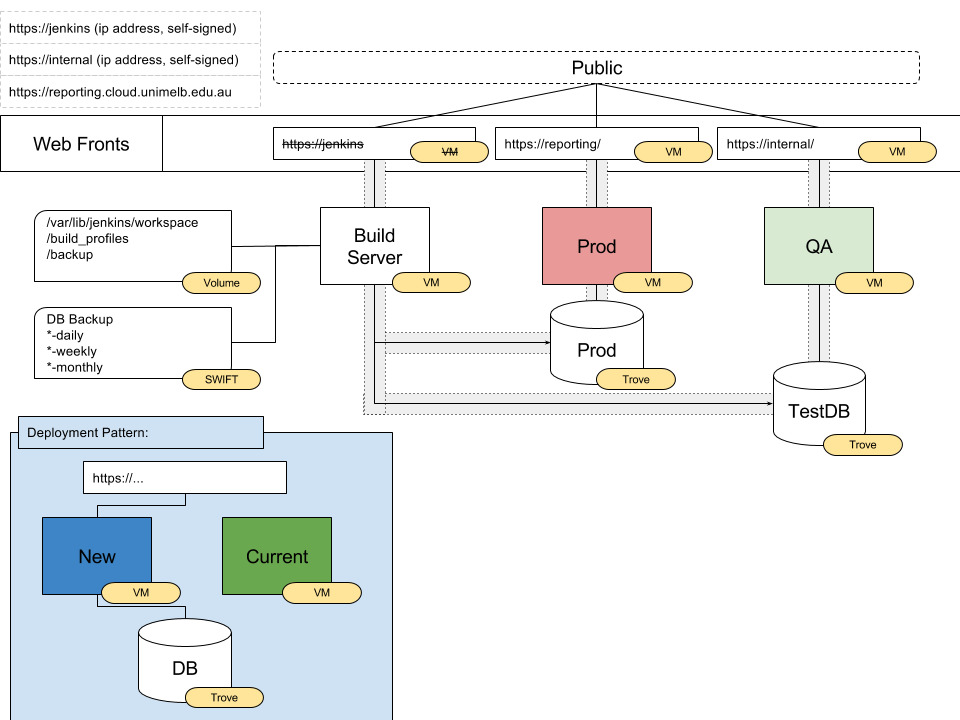

# Jenkins scripts and other things

This folder contains materials used in Jenkins builds and is referenced by the Jenkinsfile in the root directory.

## Design Overview

### Web Front

A simple web server that proxy passes to an application server. This allows the build pipeline to implement a Blue-Green deployment patten as well as stricting access to application servers.

See [web_front](web_front).

__Current Web Fronts__:
* _reporting.cloud.unimelb.edu.au_: The production instance that serves the application
* _internal_: Serves a "QA" instance of the application so that we can run a UAT on new builds before confirming deployment
* _~~jenkins~~_: Serves the Jenkins build server. (Currently this web front does not exist)

### Deployment Pattern

A jenkins pipeline is used to build, test and deploy instances of the application. The application is packaged as a whole VM instance, and orchestrated by OpenStack HEAT. This is captured by [OS_deploy_replace.bash](OS_deploy_replace) script which is invoked by the pipeline. The script will:
* HEAT deploy a new instance of the application following the [deploy.yaml](deploy.yaml) template
* Wait for deployment completion and confirmation of a successfuly deployment
* Update Web front server reporting.cloud.unimelb.edu.au (Prod) or internal (QA) to the new instance
* Delete all old stacks
By updating the web front server only when everything is successful, we can ensure minimal risks to operation of this application.

See [Setup](#setup) section for instructions.

### Databases

The application uses PostgreSQL for application state. As such they are not frequently brought down/up. They are hosted on OpenStack Trove instances.

Two instances are used:
* _Prod_: For the production application. This is the definitive source of the latest information for the application
* _TestDB_: For the QA instance of the application. A nightly process will ensure this database is a copy of the _Prod_ database. This allows the new code changes to be reviewed by testing to be applied to production data safely. Schema changes from code changes are applied via django's _python manage.py migrate_. This copy process is apart of the backup system. See Backup.

New instances of the application connect to their respective database instance simply through connection details in local\_settings.py that is copied by [OS_deploy_replace.bash](OS_deploy_replace.bash) on creation. See Setup section for instructions.

### Jenkins Server

A VM running Jenkins is used to facilitate the build pipeline. The build pipeline scope includes:
* Local build, test and test documentation
* Deploy QA instance
* Deploy Prod instance

For pipeline logic, see [Jenkinsfile](../Jenkinsfile)

For Jenkins server, see https://github.com/AlanCLo/JenkinsServer

See [Setup](#setup) for how to setup parameters for these builds

### Backup

Nightly processes will perform full database dumps of the Prod database. Backup is stored on OpenStack SWIFT using duplicity. This system is also used to mirror the QA database with Prod by executing database restoration with the latest backup. Backups stored includes:
* Daily
* Weekly
* Monthly
Rolling window policies are applied to each of these frequencies and backups older than X will be removed.

Currently, the Jenkins Server is reponsible for execution of backup scripts and restoration.

For backup scripts documentation, see https://github.com/AlanCLo/JenkinsServer/duplicity 

## Setup

